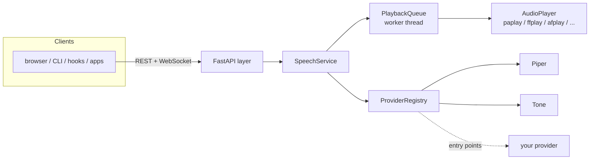

<p align="center">
  <picture>
    <source media="(prefers-color-scheme: dark)" srcset="assets/logo-dark.svg">
    
  </picture>
</p>

<p align="center"><strong>A local HTTP/WebSocket text-to-speech gateway with interchangeable engines.</strong></p>

<p align="center">
  <a href="https://github.com/DMGiulioRomano/TTS-Gateway/actions/workflows/ci.yml"></a>
  <a href="https://pypi.org/project/ttsgateway/"></a>
  <a href="https://pypi.org/project/ttsgateway/"></a>
  
  <a href="LICENSE"></a>
  <a href="https://github.com/DMGiulioRomano/TTS-Gateway/discussions"></a>
</p>

<p align="center">
  <a href="https://dmgiulioromano.github.io/TTS-Gateway/samples/">🔊 Hear it</a> ·
  <a href="#install">Install</a> ·
  <a href="#the-api-in-30-seconds">API</a> ·
  <a href="#included-integrations">Integrations</a> ·
  <a href="#documentation">Docs</a>
</p>

Send text from anywhere — a browser, Claude Code, a shell script, an editor —
and hear it spoken on your machine. TTS engines are pluggable providers behind
one stable API: [Piper](https://github.com/OHF-Voice/piper1-gpl) ships first,
and new engines (Kokoro, XTTS, cloud APIs...) drop in without touching the
server. No TTS engine installed yet? It still speaks: a built-in
dependency-free `tone` provider beeps the text, so you can verify the whole
pipeline before setting up Piper.

## Install

**pip / pipx** (Python 3.10+):

```sh
pip install ttsgateway        # or: pipx install ttsgateway (isolated, recommended)
```

**One-line script** (uses pipx when present, else `pip --user`):

```sh
curl -fsSL https://raw.githubusercontent.com/DMGiulioRomano/TTS-Gateway/main/scripts/install.sh | sh
```

**Docker** (API + synthesis; playback needs host audio — see
[docs/installation.md](docs/installation.md)):

```sh
docker build -t tts-gateway https://github.com/DMGiulioRomano/TTS-Gateway.git
docker run --rm -p 5111:5111 tts-gateway
```

> The PyPI distribution is `ttsgateway` (the `tts-gateway` name was taken);
> the command it installs is still `tts-gateway`.

## The 60-second tour

Start the server:

```console
$ tts-gateway serve
INFO:     Uvicorn running on http://127.0.0.1:5111 (Press CTRL+C to quit)
```

Speak from a second terminal (beeps until Piper is set up):

```console
$ tts-gateway speak "It works"
[9e01742e98c1] synthesizing via tone
```

Or over HTTP — `interrupt: true` cuts off whatever is playing and speaks now:

```console
$ curl -X POST localhost:5111/v1/speak -H 'content-type: application/json' \
    -d '{"text": "Coming through", "interrupt": true}'
{"utterance":{"id":"c156561e4f1b","text":"Coming through","provider":"tone","state":"synthesizing",...}}
```

Check what the gateway is doing:

```console
$ tts-gateway status
default provider : tone
playback         : available
speaking         : (idle)
queued           : 0/64
```

### Give it a real voice (Piper)

```sh
pip install piper-tts

mkdir -p ~/.local/share/tts-gateway/piper
python3 -m piper.download_voices en_US-lessac-medium \
  --data-dir ~/.local/share/tts-gateway/piper

tts-gateway speak "Now with an actual voice"
```

The gateway's default provider is `auto`: it picks Piper as soon as the
binary and a voice model are found, and falls back to `tone` otherwise.
`tts-gateway providers` shows what is available and why. Full details (voice
downloads, macOS/Linux audio notes, running as a service):
[docs/installation.md](docs/installation.md).

## Why

- **One API, many engines.** Clients never care which engine is speaking.
  Switch from Piper to anything else by editing one config line.
- **A real speech queue.** Utterances play in order; `interrupt: true`
  cancels everything and speaks now. `POST /v1/stop` silences the room.
- **Anything can talk.** REST + WebSocket + CLI + a browser userscript + a
  Claude Code hook, all included and all tiny.
- **Local-first.** Binds to `127.0.0.1` by default; with Piper, audio never
  leaves your machine.
- **Small.** Four runtime dependencies: FastAPI, uvicorn, pydantic, PyYAML.

### How it compares

|                              | tts-gateway | raw `piper` CLI | `speech-dispatcher` / `say` | cloud TTS APIs |
| ---------------------------- | :---------: | :-------------: | :-------------------------: | :------------: |
| Speech queue + interrupt     | ✅          | ❌              | partial¹                    | ❌ (DIY)       |
| Swappable engines            | ✅          | ❌ (Piper only) | ✅ (its own modules)        | ❌ (one vendor) |
| HTTP + WebSocket API         | ✅          | ❌              | ❌ (DBus/local socket)      | ✅             |
| Browser / editor integrations| ✅ included | ❌              | ❌                          | DIY            |
| Works offline                | ✅          | ✅              | ✅                          | ❌             |
| Cost                         | free        | free            | free                        | per character  |

¹ `speech-dispatcher` queues and cancels, but speaks only for local
processes on Linux — there is no network API for browsers, editors, or
other machines' tools.

## The API in 30 seconds

| Endpoint               | What it does                                              |
| ---------------------- | --------------------------------------------------------- |
| `POST /v1/speak`       | Queue text; options: `provider`, `voice`, `speed`, `interrupt`, `wait` |
| `POST /v1/stop`        | Stop the current utterance and clear the queue            |
| `POST /v1/synthesize`  | Return audio bytes instead of playing them                |
| `GET /v1/status`       | Current utterance, queue, recent history                  |
| `GET /v1/voices`       | Voices across providers (`?provider=` to filter)          |
| `GET /v1/providers`    | Registered providers + availability + which is default    |
| `GET /v1/utterances/{id}` | State of one utterance                                 |
| `WS /v1/ws`            | Commands + live utterance lifecycle events                |
| `GET /health`          | Liveness + version                                        |

Interactive docs are served at [`/docs`](http://127.0.0.1:5111/docs); the
full reference with the WebSocket protocol is in [docs/api.md](docs/api.md).

```sh
# speed up, pick a voice, cut off whatever is playing:
curl -X POST localhost:5111/v1/speak -H 'content-type: application/json' \
  -d '{"text": "Faster now", "voice": "en_US-lessac-medium", "speed": 1.4, "interrupt": true}'
```

## Included integrations

- **Browser** — a [userscript](integrations/browser) that speaks any selected
  text on any website (Alt+S / Alt+X).
- **Claude Code** — a [hook script](integrations/claude-code) that reads
  Claude's replies and notifications aloud.
- **Terminal** — the `tts-gateway` CLI (`speak`, `stop`, `status`, `voices`,
  `providers`, `synthesize`), plus [shell aliases](examples/README.md).
- **Your code** — a zero-dependency Python client
  (`tts_gateway.client.GatewayClient`) and [examples](examples) for REST and
  WebSocket.

## Configuration

Optional — the defaults just work. Generate an annotated config with
`tts-gateway init-config` (written to `~/.config/tts-gateway/config.yaml`):

```yaml
speech:
  default_provider: auto   # or: piper, tone, ...
providers:
  piper:
    models_dir: ~/.local/share/tts-gateway/piper
    default_voice: en_US-lessac-medium
```

Every key can also be set by environment variable
(`TTS_GATEWAY__SERVER__PORT=6000`). See
[docs/configuration.md](docs/configuration.md).

## Architecture



Clean layers: a framework-free core (models, queue, service), providers and
players as swappable adapters, FastAPI kept at the edge. The reasoning and
the locking/lifecycle rules live in [docs/architecture.md](docs/architecture.md).

**Adding an engine** means implementing one small interface
(`synthesize`, `voices`, `availability`) and registering it — either in-tree
or from your own package via the `tts_gateway.providers` entry point group,
with no gateway changes. Walkthrough: [docs/providers.md](docs/providers.md).

## Documentation

| | |
| --- | --- |
| [docs/installation.md](docs/installation.md) | Install, Piper voices, audio output, service setup |
| [docs/configuration.md](docs/configuration.md) | Every option, file + env layering |
| [docs/api.md](docs/api.md) | REST + WebSocket reference |
| [docs/architecture.md](docs/architecture.md) | Design, layers, threading model |
| [docs/providers.md](docs/providers.md) | Writing a new TTS provider |
| [docs/development.md](docs/development.md) | Dev setup, tests, linting, release |
| [CONTRIBUTING.md](CONTRIBUTING.md) | How to contribute |
| [CHANGELOG.md](CHANGELOG.md) | Release history |

## Star history

<a href="https://star-history.com/#DMGiulioRomano/TTS-Gateway&Date">
  <picture>
    <source media="(prefers-color-scheme: dark)" srcset="https://api.star-history.com/svg?repos=DMGiulioRomano/TTS-Gateway&type=Date&theme=dark">
    
  </picture>
</a>

## License

[MIT](LICENSE).
