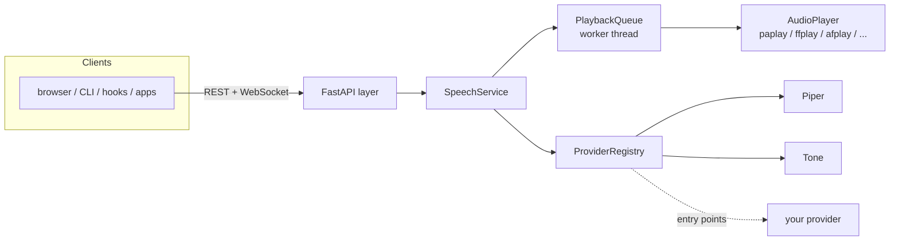

# tts-gateway

**A local HTTP/WebSocket text-to-speech gateway with interchangeable engines.**

Send text from anywhere — a browser, Claude Code, a shell script, an editor —
and hear it spoken on your machine. TTS engines are pluggable providers behind
one stable API: [Piper](https://github.com/OHF-Voice/piper1-gpl) ships first,
and new engines (Kokoro, XTTS, cloud APIs...) drop in without touching the
server.

[](https://github.com/DMGiulioRomano/TTS-Gateway/actions/workflows/ci.yml)
[](LICENSE)


```sh
pip install .            # from a checkout
tts-gateway serve        # http://127.0.0.1:5111
```

```sh
curl -X POST localhost:5111/v1/speak \
  -H 'content-type: application/json' \
  -d '{"text": "Hello from the gateway"}'
```

No TTS engine installed yet? It still speaks: a built-in dependency-free
`tone` provider beeps the text, so you can verify the whole pipeline (server →
queue → audio output) before setting up Piper.

## Why

- **One API, many engines.** Clients never care which engine is speaking.
  Switch from Piper to anything else by editing one config line.
- **A real speech queue.** Utterances play in order; `interrupt: true`
  cancels everything and speaks now. `POST /v1/stop` silences the room.
- **Anything can talk.** REST + WebSocket + CLI + a browser userscript + a
  Claude Code hook, all included and all tiny.
- **Local-first.** Binds to `127.0.0.1` by default; with Piper, audio never
  leaves your machine.
- **Small.** Four runtime dependencies: FastAPI, uvicorn, pydantic, PyYAML.

## Quick start

```sh
git clone https://github.com/DMGiulioRomano/TTS-Gateway.git
cd TTS-Gateway
pip install .

tts-gateway serve                    # terminal 1
tts-gateway speak "It works"         # terminal 2 (beeps until Piper is set up)
```

### Give it a real voice (Piper)

```sh
pip install piper-tts

mkdir -p ~/.local/share/tts-gateway/piper
python3 -m piper.download_voices en_US-lessac-medium \
  --data-dir ~/.local/share/tts-gateway/piper

tts-gateway speak "Now with an actual voice"
```

The gateway's default provider is `auto`: it picks Piper as soon as the
binary and a voice model are found, and falls back to `tone` otherwise.
`tts-gateway providers` shows what is available and why. Full details (voice
downloads, macOS/Linux audio notes, running as a service):
[docs/installation.md](docs/installation.md).

## The API in 30 seconds

| Endpoint               | What it does                                              |
| ---------------------- | --------------------------------------------------------- |
| `POST /v1/speak`       | Queue text; options: `provider`, `voice`, `speed`, `interrupt`, `wait` |
| `POST /v1/stop`        | Stop the current utterance and clear the queue            |
| `POST /v1/synthesize`  | Return audio bytes instead of playing them                |
| `GET /v1/status`       | Current utterance, queue, recent history                  |
| `GET /v1/voices`       | Voices across providers (`?provider=` to filter)          |
| `GET /v1/providers`    | Registered providers + availability + which is default    |
| `GET /v1/utterances/{id}` | State of one utterance                                 |
| `WS /v1/ws`            | Commands + live utterance lifecycle events                |
| `GET /health`          | Liveness + version                                        |

Interactive docs are served at [`/docs`](http://127.0.0.1:5111/docs); the
full reference with the WebSocket protocol is in [docs/api.md](docs/api.md).

```sh
# speed up, pick a voice, cut off whatever is playing:
curl -X POST localhost:5111/v1/speak -H 'content-type: application/json' \
  -d '{"text": "Faster now", "voice": "en_US-lessac-medium", "speed": 1.4, "interrupt": true}'
```

## Included integrations

- **Browser** — a [userscript](integrations/browser) that speaks any selected
  text on any website (Alt+S / Alt+X).
- **Claude Code** — a [hook script](integrations/claude-code) that reads
  Claude's replies and notifications aloud.
- **Terminal** — the `tts-gateway` CLI (`speak`, `stop`, `status`, `voices`,
  `providers`, `synthesize`), plus [shell aliases](examples/README.md).
- **Your code** — a zero-dependency Python client
  (`tts_gateway.client.GatewayClient`) and [examples](examples) for REST and
  WebSocket.

## Configuration

Optional — the defaults just work. Generate an annotated config with
`tts-gateway init-config` (written to `~/.config/tts-gateway/config.yaml`):

```yaml
speech:
  default_provider: auto   # or: piper, tone, ...
providers:
  piper:
    models_dir: ~/.local/share/tts-gateway/piper
    default_voice: en_US-lessac-medium
```

Every key can also be set by environment variable
(`TTS_GATEWAY__SERVER__PORT=6000`). See
[docs/configuration.md](docs/configuration.md).

## Architecture



Clean layers: a framework-free core (models, queue, service), providers and
players as swappable adapters, FastAPI kept at the edge. The reasoning and
the locking/lifecycle rules live in [docs/architecture.md](docs/architecture.md).

**Adding an engine** means implementing one small interface
(`synthesize`, `voices`, `availability`) and registering it — either in-tree
or from your own package via the `tts_gateway.providers` entry point group,
with no gateway changes. Walkthrough: [docs/providers.md](docs/providers.md).

## Documentation

| | |
| --- | --- |
| [docs/installation.md](docs/installation.md) | Install, Piper voices, audio output, service setup |
| [docs/configuration.md](docs/configuration.md) | Every option, file + env layering |
| [docs/api.md](docs/api.md) | REST + WebSocket reference |
| [docs/architecture.md](docs/architecture.md) | Design, layers, threading model |
| [docs/providers.md](docs/providers.md) | Writing a new TTS provider |
| [docs/development.md](docs/development.md) | Dev setup, tests, linting, release |
| [CONTRIBUTING.md](CONTRIBUTING.md) | How to contribute |
| [CHANGELOG.md](CHANGELOG.md) | Release history |

## License

[MIT](LICENSE).
