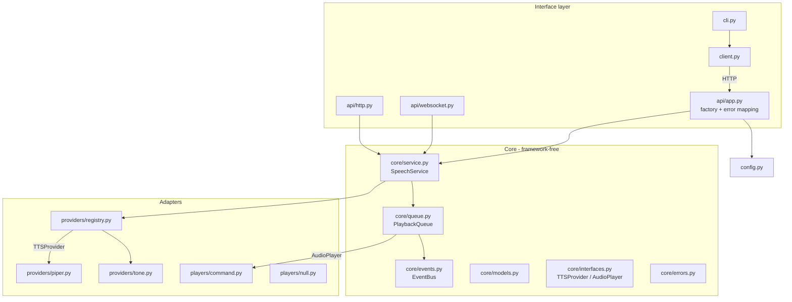

# Architecture

This document explains how the gateway is put together and why. Read it
before extending the core; for adding a TTS engine you only need
[providers.md](providers.md).

## Goals that shaped the design

1. **Provider-agnostic forever.** Engines change often (Piper today; Kokoro,
   XTTS, cloud APIs tomorrow). Nothing outside the provider package may know
   engine details, and new engines must be installable without touching the
   server.
2. **A speech queue that behaves like a human assistant.** Utterances play in
   submission order, interruption is instant, and one broken utterance never
   jams the pipeline.
3. **Small and boring.** Four runtime dependencies. Threads and locks are
   confined to two files with documented rules. No streaming, no daemons of
   daemons, no plugin framework beyond Python entry points.

## Layers



Dependency rules:

- `core/` imports **no** web framework and **no** concrete provider/player.
  It defines the models, the two ports (`TTSProvider`, `AudioPlayer`), and
  the orchestration (`PlaybackQueue`, `SpeechService`, `EventBus`).
  (`core/service.py` does import the *registry* — the abstraction that hands
  out providers by name — but never an engine.)
- `providers/` and `players/` implement the ports. Each engine lives in one
  file and knows nothing about HTTP or the queue.
- `api/` is the only place FastAPI appears; `create_app` wires the object
  graph and owns the single table mapping domain errors to HTTP statuses.
- `config.py` is pure data (pydantic models + layered loading); it is passed
  *into* constructors — nothing reads global state.

The result: the whole speech engine can be embedded without the web server
(`SpeechService` + a registry + a player), and the API can be tested with
fake everything.

## The speech pipeline

`POST /v1/speak` does very little on the request thread:

1. Validate the DTO (pydantic) and business limits (service).
2. Resolve the provider name (explicit → configured default → `auto`
   priority scan over `availability()`).
3. Create an `Utterance` (a small state machine) and submit it to the
   `PlaybackQueue` with a zero-argument `synthesize` closure — or, for a long
   text, one closure per sentence chunk (see *sentence-level pipelining*).
4. Return 202 with the utterance snapshot.

A single **worker thread** owns the rest of the lifecycle:

```
QUEUED ── worker picks item ──> SYNTHESIZING ──> SPEAKING ──> FINISHED
   │                                │               │
   └── clear()/interrupt ──────> CANCELLED <────────┘        FAILED (any step)
```

Synthesis happens **on the worker, not at submit time**. That choice buys:
strict playback ordering for free, instant `202` responses, and no wasted
engine work when an interrupt lands first. The cost — synthesis errors are
reported asynchronously — is covered by `wait: true`, `/v1/utterances/{id}`,
and the event stream.

### Interruption

`stop()`/`interrupt: true` must never wait for a clip to finish:

- every pending utterance is flagged (`request_cancel`) and moved to
  `CANCELLED`;
- the player's `stop()` is called, which terminates the playback subprocess
  (its whole process group, so shell wrappers can't leak children);
- the worker's blocking `play()` returns `False` and the worker finalizes
  the current utterance as `CANCELLED`.

Cancellation is cooperative and checked at every stage boundary, so a
mid-synthesis interrupt takes effect the moment the engine returns.

### Threading and locking rules

There are exactly three kinds of threads: the asyncio event loop (FastAPI),
`anyio` worker threads for service calls that may block, and the one
playback worker. The rules, enforced by comment and test:

- `PlaybackQueue._condition` guards the deque, current item, history, and
  closed flag — and is **never held** while synthesizing, playing,
  publishing events, or transitioning utterance state.
- The chunk look-ahead `ThreadPoolExecutor` (single slot) is driven **only**
  by the one playback worker — one chunk in flight at a time — so it adds a
  helper thread but no new shared state and needs no extra lock.
- `Utterance` state changes go through `transition()` under the utterance's
  own lock; terminal states latch (a race can never resurrect a finished
  job).
- `EventBus.publish` runs handlers synchronously on the publishing thread
  and isolates their exceptions. The WebSocket layer bridges to asyncio via
  `loop.call_soon_threadsafe` into a bounded queue (oldest events dropped
  for slow consumers). Event payloads are snapshots taken at publish time
  and are authoritative; cross-event ordering is best-effort.

### Whole clips, and sentence-level pipelining

Providers return a complete `AudioClip` — never a stream. True audio
streaming would lower time-to-first-sound for long texts, but it infects
every interface it touches (provider, queue, player, interruption, the HTTP
API) with chunk lifecycle concerns.

For long texts the gateway instead pipelines at **sentence granularity**
(`speech.chunking`), which buys most of the latency win without any of that
cost: the service splits the text into sentences (`core/chunking.py`, a pure
regex splitter) and submits them as one chunked utterance; the worker speaks
sentence N while sentence N+1 synthesizes on a single-slot
`ThreadPoolExecutor` it owns (look-ahead depth one). Crucially this changes
**nothing** in the contracts around it: the provider still receives a
complete text and returns a complete clip, and the utterance keeps one id and
the same `QUEUED → SYNTHESIZING → SPEAKING → FINISHED` state machine — a
chunked run just adds an optional `utterance.progress` event per sentence.
Disabling `speech.chunking` (or a text below `min_chars`) restores exactly
one clip per utterance. A true streaming *provider* port could still be added
later without disturbing this one.

## Providers

`TTSProvider` is deliberately synchronous (`synthesize(request) -> AudioClip`):
engines are subprocesses or blocking HTTP calls, the gateway supplies the
threads, and a sync contract keeps third-party implementations trivial. See
[providers.md](providers.md) for the full contract (including
`availability()`'s "explain how to fix it" convention) and the entry-point
mechanism that makes external provider packages plug in with zero gateway
changes.

The `tone` provider exists so the pipeline is demonstrable and testable with
no engine installed; it is also the deterministic workhorse of the test
suite.

## Players

`AudioPlayer.play(clip)` blocks until done or stopped — that blocking
contract is what makes ordered, interruptible playback trivial upstream.
`CommandPlayer` shells out to whatever the machine already has (`pw-play`,
`paplay`, `aplay`, `ffplay`, `mpv`, `afplay`...), auto-detected per platform
and per clip format, overridable with one config key. `NullPlayer` keeps
headless deployments and tests silent.

## Configuration

Layered: defaults ← YAML file ← `TTS_DAEMON__SECTION__KEY` env vars, all
validated by strict pydantic models (unknown keys are startup errors —
typos fail loudly). Provider sections are free-form mappings passed through
to the engine, so a provider can grow settings without core changes.

## Testing strategy

- **Unit**: every core class in isolation with controllable doubles
  (`ControllablePlayer`, `BlockingProvider`) — queue ordering, interrupts,
  error containment, config layering, registry/entry-points.
- **Piper without piper**: the provider is exercised against a fake `piper`
  shell script, so argument building, stdin, exit codes, and timeouts are
  tested through a real subprocess.
- **Integration**: the real FastAPI app over `TestClient` — REST contract,
  status codes, WebSocket protocol and event streaming, queue-full and
  stop-cancels-backlog scenarios.

## Stability promises

- `/v1` request/response shapes: additive changes only.
- `TTSProvider` / `AudioPlayer`: stable; new *optional* methods may appear
  with default implementations.
- Utterance states and event type names: fixed vocabulary, additions
  possible.
